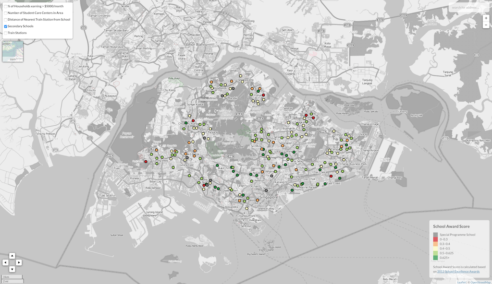

# Geospatial Analytics using Leaflet.js

In light of what the government constantly drums into our heads about every school being a good school, I decided to investigate this claim by taking a look at the different schools and how each school fares with another. For a refresher on "Every school, a good school", look no further than [the budget of 2014](https://www.youtube.com/watch?v=GU7ylWowros&feature=youtube_gdata_player)

The application can be found running at [http://aaronmak.github.io/ga-a1]( http://aaronmak.github.io/ga-a1).

